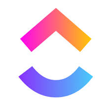
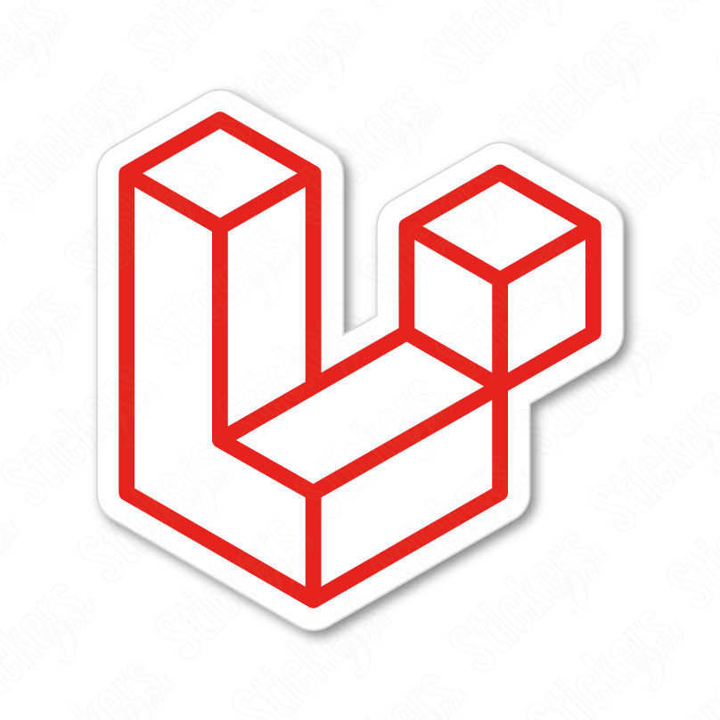
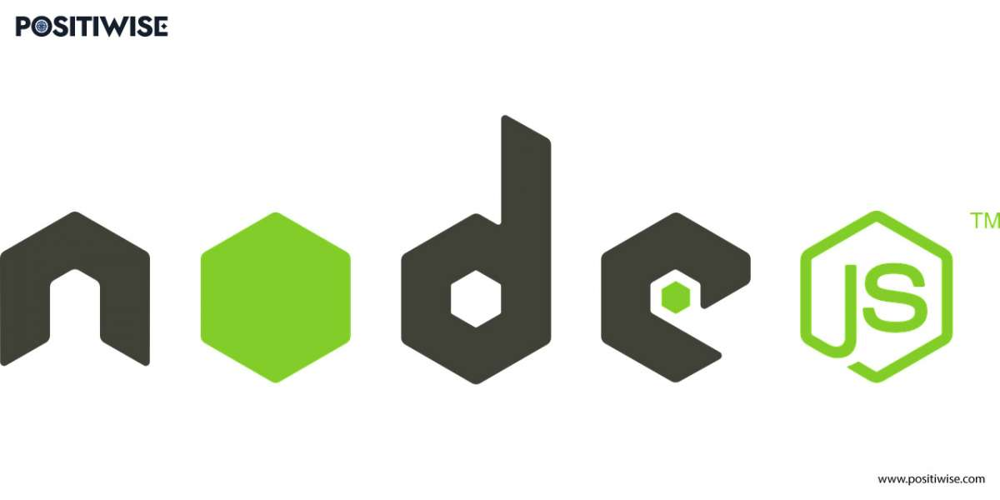

# Centro de Llamadas
|  | **Nuevo sistema integral de reclamos/denuncias para atención al ciudadano, mejorando la eficiencia y transparencia en la gestión municipal y promoviendo una ciudad más conectada y participativa.** |
|------------------------------------------------|---------------------------------------------------------------------------------------------------------------------------------------------------------------------------------------------------------------------------|

## Herramientas Manejadas
- **Diseño UI/UX**: Figma

    

- **Gestion del proyecto**: ClickUp

    

## Tecnologías Utilizadas
- **Frontend**: Angular
    
    

- **Backend**: Laravel, Node.js, NestJS

      

- **Base de Datos**: PostgreSQL

    

## Instalación
...

## Uso
Accede a la interfaz de usuario en tu navegador y sigue las instrucciones para registrar o seguir un reclamo.

> [!IMPORTANT]
> [Documentacion](docs/README.md): Carpeta detallada del sistema. Puede incluir guías de usuario, manuales de desarrollador, diagramas, etc.
